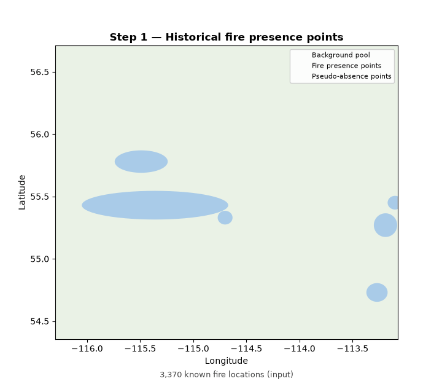
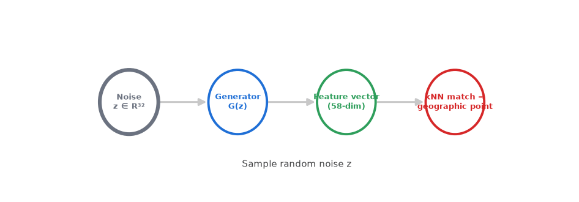

# Pseudo-Absence Generator

A framework for generating, validating, and benchmarking pseudo-absence samples for presence-only machine learning and spatial prediction tasks.

## Overview

Many predictive modeling problems provide observations of events or occurrences (presences) but lack reliable records of non-occurrence (absences). To enable supervised learning, pseudo-absence samples are generated to represent background or non-event conditions.

This repository provides a flexible framework for creating and evaluating pseudo-absence samples using multiple sampling strategies. The framework supports reproducible experimentation, spatial analysis, and comparative evaluation of sampling methods.

## Features

- Multiple pseudo-absence generation strategies
- Spatially-aware sampling workflows
- Feature-space and environmental constraints
- Spatial point-pattern analysis
- Statistical comparison of sampling methods
- Spatial cross-validation support
- Integration with machine learning pipelines
- Reproducible benchmarking framework



*Fire presence points → candidate background pool → feature-space WGAN selection (kNN + border-aware weighting) → final spatially-distributed pseudo-absence set. Generated by `src/figures/make_algorithm_gif.py`.*



*Schematic view of the same pipeline: noise → generator → synthetic feature vector → kNN match to a real background location. Generated by `src/figures/make_logic_diagram_gif.py`.*

## Repository structure

```
src/
  generation/   Pseudo-absence generation methods (GAN, simulated annealing, random, heuristic)
  evaluation/   ML benchmarking and spatial evaluation of generated samples
  figures/      Plotting / reporting scripts that consume generation & evaluation outputs
  reporting/    Excel / Word report generators
docs/           Methodology diagrams, result write-ups, and rendered figures (docs/figures/)
data/           Place Fire_points_dataset_final_csv.csv here (not versioned, see data/README.md)
outputs/        Generated .npy/.csv/.png artifacts land here (not versioned)
```

## Setup

```
pip install -r requirements.txt
```

Place `Fire_points_dataset_final_csv.csv` in `data/` (see `data/README.md`), then run scripts
from within their own `src/<subfolder>/` directory — each one locates `data/` and `outputs/`
via a relative `../../` path.

## Important: which generation method is canonical

This repo contains **three different pseudo-absence GAN implementations** in `src/generation/`:

- **`gen_gan.py`** — Feature-space WGAN-GP. The generator maps noise directly to an
  environmental feature vector (no coordinates involved in generation); geographic coordinates
  are assigned afterward via a PCA + soft-kNN mapping against a background pool. This avoids
  border clustering by construction and is the method described in the accompanying paper's
  "Feature-Space WGAN" methodology. Trains with a domain-aware WGAN-GP critic
  (`CRITIC_CONSTRAINT = "clip" | "gp_standard" | "gp_domain_aware"`), not weight clipping.
- **`run_stage1_gan.py`** and **`gen_random_bpv6_gan.py`** — coordinate-space WGANs: the
  generator outputs (lon, lat) directly. This is architecturally the design the feature-space
  approach is meant to avoid, and both scripts write to the same output filenames as
  `gen_gan.py`, so re-running the wrong one can silently overwrite the other's results.

**Provenance note:** at the time this repo was assembled, it could not be confirmed from local
file timestamps which of these three scripts actually produced the pseudo-absence samples used
in any previously reported results — all outputs shared identical copy timestamps and all three
scripts wrote to the same hardcoded (and non-existent-here) output path. Confirm which script
was actually run before citing results as coming from the feature-space method.

## Evaluation results (DA-GP-WGAN vs. Heuristic / Random / SA / GAN)

`src/evaluation/run_ml_da_gp_wgan.py` and `run_ml_ablation_arms.py` run the same 4-model
(RandomForest, XGBoost, KNN, SVM), 5-fold spatial cross-validation used for the other methods
against the domain-aware GP-WGAN's output and against the `clip` / `gp_standard` ablation arms.
`src/figures/gen_figs_paper_v2.py` renders the full comparison — 40 figures plus 2 "with GAN"
variants — into `docs/figures/`.

**Honest summary of what the numbers actually show:**
- DA-GP-WGAN has the best spatial fidelity of all 5 methods: lowest Ripley's K SSE (3.19 vs.
  4.87 for plain GAN) and lowest border-clustering fraction (0.253 vs. 0.281).
- It is **statistically tied with plain GAN on predictive accuracy** (SVM AUC 0.986 vs. 0.994,
  bootstrap CI includes 0) — not superior. RF/XGBoost AUC are saturated at ~1.000 for every
  method and are not a meaningful ranking signal (see `fig28`/`fig30`/`fig32` for the
  correction of an earlier normalization bug that made a statistically-flat RF-AUC column look
  like a real gap).
- The 3-way ablation (`fig36`) shows most of the spatial-fidelity gain comes from adding a
  gradient penalty *at all* (clip → GP-standard); the domain-aware weighting on top of a plain
  gradient penalty is roughly neutral in this run (K-SSE ties, border fraction is marginally
  higher than GP-standard). This is reported as measured, not adjusted to fit a cleaner story.
- Two figures are intentionally incomplete rather than fabricated: `fig37`'s critic-weight
  panel (trained critic weights were never persisted to disk) and `fig38`'s λ_GP × τ
  sensitivity heatmap (the hyperparameter sweep has not been run).
