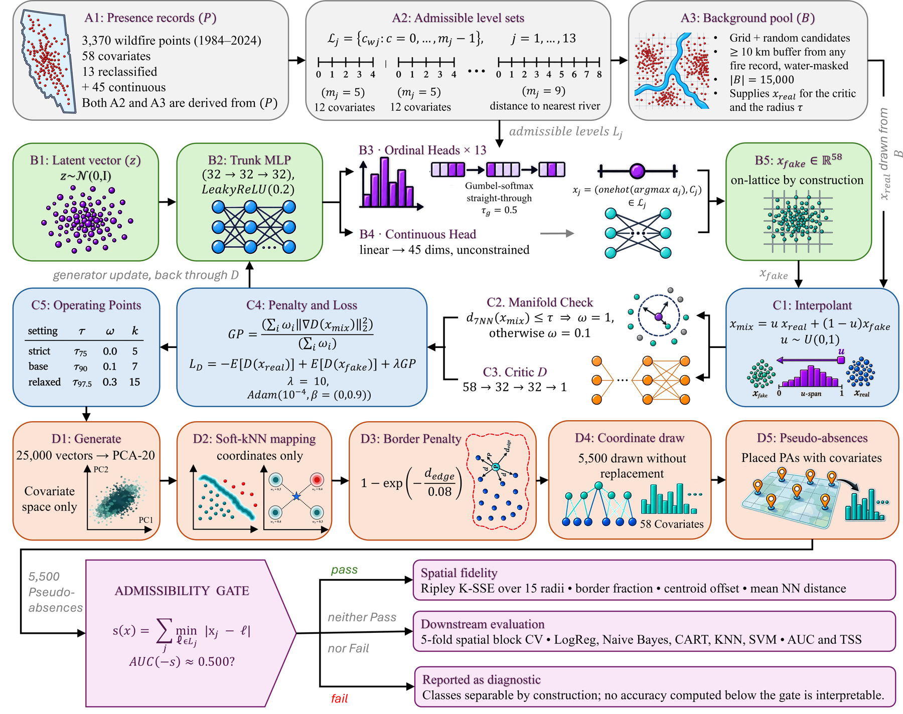

# AP-WGAN: Admissibility-Preserving Pseudo-Absence Generation

Reference implementation for:

> Razavi, H., Bonakdari, H., Zaji, A.H., Mozaffari, M.H., Bénichou, N.
> **Knowledge-Constrained Generation of Synthetic Negatives: Admissibility-Preserving Pseudo-Absence Sampling for Presence-Only Wildfire Modeling.**
> *Knowledge-Based Systems* (under review).



*Bands A to E read in order, band C right to left: A supplies the admissible level
sets, B the two output heads, C the domain-aware penalty, D placement, E the
evaluation gate.*

---

## What this repository is about

Hazard-susceptibility studies routinely reclassify continuous environmental
covariates into a handful of ordinal suitability levels before modeling. That
step, whether an analytic hierarchy process, a frequency-ratio scheme or an
information-value scheme, encodes expert judgment into the data. Every presence
record is therefore confined to a finite lattice of permitted values.

Pseudo-absences, however, are conventionally assigned covariates by
interpolation from nearby presences. Any interpolation carrying a continuous
perturbation lands **off** that lattice with probability one. The two practices
interact destructively:

> The summed distance to the nearest permitted level, a scalar carrying no
> environmental information at all, is identically zero for every presence and
> strictly positive for every pseudo-absence. The two score distributions are
> disjoint, so a classifier reading that single quantity separates the classes
> at **AUC = 1.000**.

That is enough to account for the saturated tree-ensemble accuracies reported
where these two practices meet. **AP-WGAN** removes the artifact at its source:
its ordinal output heads emit only permitted levels, via a straight-through
Gumbel-softmax relaxation over each covariate's admissible set, so the
diagnostic returns exactly 0.5 for every draw regardless of seed.

**What this repository does not claim.** AP-WGAN is not more accurate than the
alternatives, and the paper does not argue that it is. Projecting interpolated
covariates onto the nearest permitted level is a simpler route to the same
guarantee, and no experiment here separates the two. A second artifact, a local-geometry fingerprint
left by the averaging inherent to interpolation, is characterised rather than solved. See §7.1 of the paper.

---

## The diagnostic, in isolation

If you take one thing from this repository, take this. Before reporting any
accuracy on a presence-only model with reclassified covariates, check whether
your negative class is separable on grounds unrelated to environment:

```python
import numpy as np

def admissible_levels(X_presence, ordinal_cols):
    """Recover the permitted level set of each reclassified covariate.
    Nothing is estimated: reclassification produced these values."""
    return {j: np.unique(X_presence[:, j]) for j in ordinal_cols}

def admissibility_score(X, levels):
    """s(x) = sum_j min_l |x_j - l|.  Zero iff x lies on the lattice."""
    return sum(np.abs(X[:, j][:, None] - L[None, :]).min(axis=1)
               for j, L in levels.items())

# tell = AUC of ranking presence vs pseudo-absence on -s(.)
from sklearn.metrics import roc_auc_score
levels = admissible_levels(X_pres, ordinal_cols)
s      = admissibility_score(np.vstack([X_pres, X_pa]), levels)
y      = np.r_[np.ones(len(X_pres)), np.zeros(len(X_pa))]
tell   = roc_auc_score(y, -s)
```

`tell ≈ 0.5` means no construction signal. `tell ≈ 1.0` means your classes are
separable by construction and downstream accuracy cannot be read as evidence of
environmental discrimination until the artifact is corrected. On the Alberta
data it is **1.00000 with zero variance across seeds** for all five
non-admissible strategies, and **0.50000** for the three AP-WGAN arms.

The full version, with the on-lattice rate and the restoration test, is
`src/evaluation/admissibility_test.py`.

---

## Repository layout

```
src/
  generation/
    train_variants.py          arm ladder: clip, gp_standard, v1_da_gp, v2_admissible
    retrain_all.py             driver: every arm x 3 seeds, crash-safe resume
    regen_baselines.py         Random and Heuristic baselines
    run_sweeps.py              tau / omega / k sweeps
    pseudo_absence_pipeline.py background pool, IDW assignment, soft-kNN mapping
    gen_rand_bp.py             uniform background sampling
  evaluation/
    admissibility_test.py      the tell and the on-lattice rate
    construction_audit.py      both artifacts + matched controls
    evaluate_arms.py           5-classifier spatial-block CV over all arms/seeds
    classifier_suite.py        the five classifier definitions
    projection_response.py     downstream response to projecting 0..13 covariates
    e4_dual_artifact.py        the 2x2 lattice x bandwidth audit
    quebec_validation.py       transfer test against observed non-fire records
    recompute_spatial.py       Ripley K-SSE, border fraction, centroid, NN distance
    recompute_table2.py        covariate discriminability
    f33_confound_checks.py     joint-structure confound tests
    seed_study_summary.py      aggregation across seeds
    verify_project.py          non-destructive check of a completed run
  figures/
    figstyle.py                shared matplotlib style
    generate_all.py            main figure set
    generate_batch2.py .. batch8.py  incremental figure batches
    generate_e4.py             the 2x2 condition figures
    make_arch_figure.py        architecture schematic (superseded by the final artwork)
data/                          empty; see data/README.md
outputs/                       generated point sets and metrics land here
```

Simulated annealing, present in the earlier version of this work, is **not**
included: it optimises coordinate-space dispersion and models no covariate
distribution, so it is out of scope for the comparison reported here.

---

## Reproduction map

Each script and the paper object it produces. Table and figure numbers follow
the manuscript as submitted.

| Paper object | Script |
|---|---|
| Table 3, covariate discriminability | `evaluation/recompute_table2.py` |
| Table 4, decision-tree AUC before/after lattice projection | `evaluation/construction_audit.py` |
| Table 5, spatial quality by strategy | `evaluation/recompute_spatial.py` |
| Tables 6 and 7, downstream AUC and TSS | `evaluation/evaluate_arms.py` |
| Table 8, Welch contrasts | `evaluation/evaluate_arms.py` |
| Table 9, critic-constraint ablation | `evaluation/recompute_spatial.py` |
| Table 10, Quebec transfer | `evaluation/quebec_validation.py` |
| Table A.12, computational cost | timings emitted by `generation/retrain_all.py` |
| Fig. 4, training dynamics | `figures/generate_all.py` |
| Fig. 9, paired shift under projection | `figures/generate_all.py` |
| Fig. 10, spatial fidelity | `figures/generate_all.py` |
| Fig. 11, parameter sweep | `generation/run_sweeps.py` then `figures/generate_batch2.py` |
| Figs. 12 and 13, AUC/TSS surfaces, bootstrap intervals | `figures/generate_batch3.py` |
| Fig. 14, local-geometry fingerprint | `evaluation/construction_audit.py` |
| Figs. 15 and 16, the four evaluation conditions | `evaluation/e4_dual_artifact.py`, `figures/generate_e4.py` |
| Fig. 18, joint covariate structure | `evaluation/f33_confound_checks.py`, `figures/generate_batch4.py` |
| Appendix figures | `figures/generate_batch8.py` |

---

## Running it

```bash
python -m pip install -r requirements.txt
```

Place the Alberta CSV and the Quebec workbook in `data/` (see `data/README.md`),
then:

```bash
# 1. baselines (fast)
python src/generation/regen_baselines.py   --data data/Fire_points_dataset_final_csv.csv --out outputs/

# 2. train every arm, three seeds each  (multi-hour, CPU-only, resumable)
python src/generation/retrain_all.py       --data data/Fire_points_dataset_final_csv.csv --out outputs/retrain/

# 3. the diagnostic
python src/evaluation/admissibility_test.py --data data/Fire_points_dataset_final_csv.csv \
                                            --pa-dir outputs/ --strategy "DA-GP-WGAN" \
                                            --out outputs/admissibility.csv

# 4. downstream evaluation
python src/evaluation/evaluate_arms.py     --retrain outputs/retrain/ --out outputs/

# 5. figures
python src/figures/generate_all.py
```

**Timing.** On CPU, the weight-clipped and uniform-penalty arms take roughly
100 to 125 s each. Arms carrying the per-interpolant manifold check take
20 to 23 min, because each interpolated sample needs a 7-NN query against the
15,000-point background pool. Three seeds across all six generative arms is a
multi-hour job; `retrain_all.py` checkpoints and resumes.

**Determinism.** Seeds 42, 43 and 44 are used throughout. The background pool
and covariate-assignment seeds are held fixed so that only the training
trajectory varies between replicates. Reported standard deviations are
attributable to optimisation, not to a redrawn candidate pool.

**Paths.** Several scripts resolve `data/` and `outputs/` relative to the
repository root. If you move a script, pass paths explicitly rather than
relying on the default.

---

## Data availability

Not included here. The Alberta wildfire records (3,370 points, 1984 to 2024,
58 covariates) and the Quebec validation workbook are available from the
corresponding author on request. `.gitignore` is deliberately aggressive about
`data/**` and every common spatial-data extension, so that the fire locations
cannot be committed by accident.

The diagnostic in this README needs none of that data. It runs on any
presence / pseudo-absence table you already have.

---

## Citation

See `CITATION.cff`, or:

```bibtex
@article{Razavi2026APWGAN,
  author  = {Razavi, Hooman and Bonakdari, Hossein and Zaji, Amir Hossein and
             Mozaffari, M. Hamed and B\'enichou, Noureddine},
  title   = {Knowledge-Constrained Generation of Synthetic Negatives:
             Admissibility-Preserving Pseudo-Absence Sampling for
             Presence-Only Wildfire Modeling},
  journal = {Knowledge-Based Systems},
  year    = {2026},
  note    = {Under review}
}
```

## License

MIT. See `LICENSE`.
